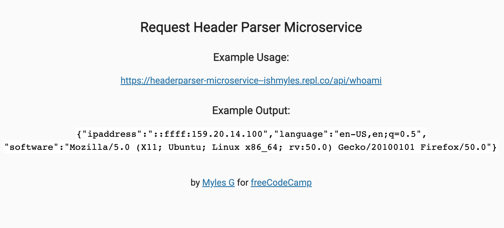
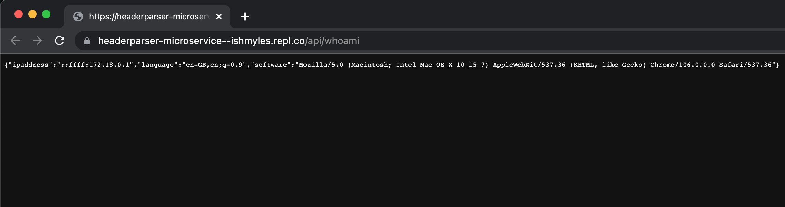

# Request Header Parser Microservice

This is the solution code for the Timestamp Microservice project on [freeCodeCamp](https://www.freecodecamp.org/learn/back-end-development-and-apis/back-end-development-and-apis-projects/request-header-parser-microservice). The live solution can be viewed [here](https://headerparser-microservice--ishmyles.repl.co/).

## Screenshots

### Example json response #1

